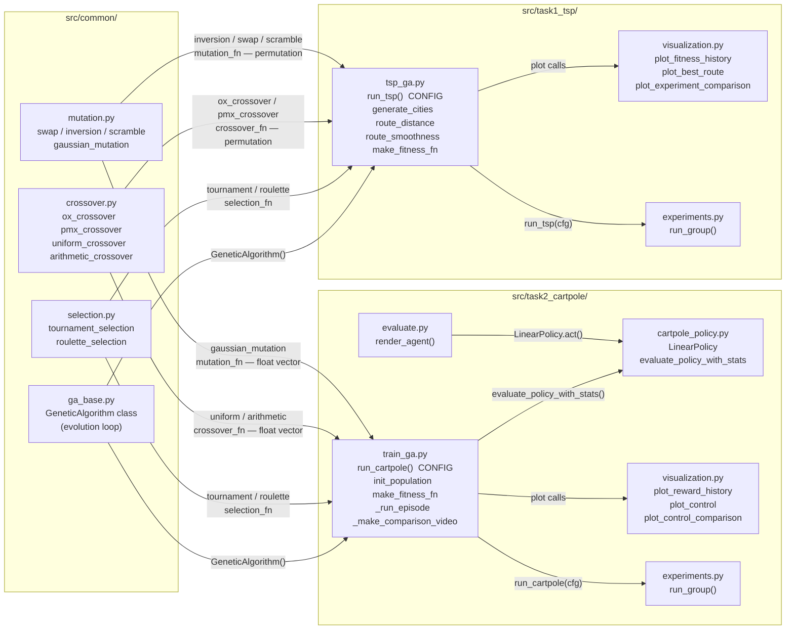

# Flowcharts — Genetic Algorithm (TSP & CartPole)

Detailed Mermaid diagrams of the algorithm structure.  
All diagrams render natively on GitHub.

---

## 1. Module Architecture

Shows how the shared `common/` package feeds both task-specific modules.
Arrows represent Python imports; edge labels show the data types exchanged.

---

## 2. General GA Loop (shared core)

Exact mapping of `GeneticAlgorithm.run()` and `_breed()` in `src/common/ga_base.py`.

```mermaid
flowchart TD
    A([START]) --> B["population = init_fn(config)\nhistory_best = []\nhistory_avg = []\nbest_so_far = -inf\nstagnation_count = 0"]

    B --> C{gen < n_generations?}
    C -- No --> Z2["fitness = _evaluate(population)\nbest_idx = argmax(fitness)"]
    Z2 --> Z3(["RETURN\nbest: population[best_idx]\nbest_fitness: float\nhistory_best: list\nhistory_avg: list\nstagnation_events: list"])

    C -- Yes --> D["fitness = _evaluate(population)"]

    subgraph eval ["_evaluate() — parallel or serial"]
        D --> D1{n_jobs == 1?}
        D1 -- Yes --> D2["serial: fitness[i] = fitness_fn(population[i])\nfor each individual"]
        D1 -- No --> D3["ThreadPoolExecutor(max_workers)\nfitness = list(executor.map(fitness_fn, population))"]
        D2 --> D4["np.array(results, dtype=float)"]
        D3 --> D4
    end

    D4 --> E["history_best.append(max(fitness))\nhistory_avg.append(mean(fitness))"]

    E --> F{current_best >\nbest_so_far + 1e-8?}
    F -- Yes --> G["best_so_far = current_best\nstagnation_count = 0\nboost = False"]
    F -- No --> H["stagnation_count += 1"]

    H --> I{stagnation_count\n>= adaptive_patience\nAND adaptive_mutation?}
    I -- No --> J["boost = False"]
    I -- Yes --> K["boost = True\nstagnation_count = 0\nrecord gen in stagnation_events\nprint '[BOOST]'"]

    G --> L
    J --> L
    K --> L

    L["elite_idx = argsort(fitness)[-n_elite:]\nelites = [population[i].copy()\n         for i in elite_idx]"]

    L --> M["n_offspring = pop_size - n_elite\nparents = selection_fn(population, fitness, n_offspring)"]

    subgraph sel ["selection_fn options"]
        M --> M1{tournament\nor roulette?}
        M1 -- tournament --> M2["k=4 random draws\npick max(fitness)\nrepeat n_offspring times"]
        M1 -- roulette --> M3["probs = fitness / sum(fitness)\nnp.random.choice(n, p=probs)"]
    end

    M2 --> N["offspring = _breed(parents, boost)"]
    M3 --> N

    subgraph breed ["_breed() — pairwise crossover + mutation"]
        N --> N1["for i in 0, 2, 4, ..., n:"]
        N1 --> N2["p1 = parents[i]\np2 = parents[(i+1) % n]"]
        N2 --> N3["c1, c2 = crossover_fn(p1, p2)"]

        subgraph cx_opts ["crossover_fn options"]
            N3 --> N3a["OX: copy segment from p1\nfill remainder from p2 in order\n→ valid permutation"]
            N3 --> N3b["PMX: copy segment from p1\nresolve conflicts via\nposition mapping"]
            N3 --> N3c["Uniform: each gene from\nrandom parent (prob=0.5)"]
            N3 --> N3d["Arithmetic: c1 = α·p1+(1-α)·p2\nc2 = (1-α)·p1+α·p2\nα ~ Uniform(0,1)"]
        end

        N3a & N3b & N3c & N3d --> N4["c1 = mutation_fn(c1)\nc2 = mutation_fn(c2)"]

        N4 --> N5{boost?}
        N5 -- Yes --> N6["c1 = mutation_fn(c1) again\nc2 = mutation_fn(c2) again\n← double mutation\n  increases exploration"]
        N5 -- No --> N7["offspring.append(c1, c2)"]
        N6 --> N7
    end

    N7 --> O["population = elites + offspring\n← size always == pop_size"]
    O --> P["gen += 1"]
    P --> C
```

---

## 3. TSP — Full Execution Flow

Maps `run_tsp()` in `src/task1_tsp/tsp_ga.py` end-to-end.

```mermaid
flowchart TD
    A([START\npython -m src.task1_tsp.tsp_ga]) --> B["os.makedirs(results_dir)\nnp.random.seed(seed)\nrng = np.random.default_rng(seed)"]

    B --> C["cities = generate_cities(n=20, seed=42)\n→ np.ndarray shape (20, 2)\n   random [0,1]² coordinates"]

    C --> D["initial_perm = rng.permutation(20)\ninitial_dist = route_distance(cities, initial_perm)"]

    D --> E["plot_best_route(cities, initial_perm,\n  initial_dist, 'initial_route.png',\n  title='Initial Random Route')\n→ saves PNG for before/after comparison"]

    E --> F["Operator factory setup:\n• crossover_fn = ox_crossover  (or pmx)\n• mutation_fn  = inversion_mutation(rate=0.10)\n• selection_fn = tournament_selection(k=4)"]

    F --> G["fitness_fn = make_fitness_fn(cities, ε=1e-6, w=0.2)"]

    subgraph fitness_detail ["Fitness calculation per individual"]
        G --> G1["d = route_distance(cities, permutation)\n= Σ‖city[i+1]−city[i]‖ + ‖city[last]−city[0]‖"]
        G1 --> G2["smoothness = 1 / (1 + CV)\nCV = std(segment_lengths) / mean(segment_lengths)\n→ 1.0 = perfectly balanced route\n→ ~0 = very jagged route"]
        G2 --> G3["f = (1 / (d + ε)) × (1 + 0.2 × smoothness)\n← maximise fitness ≡ minimise distance\n   + reward balanced routes"]
    end

    G3 --> H["ga = GeneticAlgorithm(\n  config=cfg,\n  init_fn=init_population,   ← list of random permutations\n  fitness_fn=fitness_fn,\n  crossover_fn=ox_crossover,\n  mutation_fn=inversion_mutation,\n  selection_fn=tournament_selection,\n  n_jobs=-1,                 ← parallel threads\n  adaptive_mutation=True,    ← boost on stagnation\n  adaptive_patience=25\n)"]

    H --> I(["GA LOOP\n(see Diagram 2)\n\nChromosome: int[20] permutation\nOperators preserve tour validity\npop=80, gen=300, elite=2"])

    I --> J["result = {\n  best: np.ndarray shape (20,)  ← best permutation found\n  best_fitness: float\n  history_best: list[300]\n  history_avg:  list[300]\n  stagnation_events: list[int]\n}"]

    J --> K["best_dist = route_distance(cities, result['best'])"]

    K --> L["plot_fitness_history(\n  history_best, history_avg,\n  'fitness_history.png',\n  epsilon=1e-6,\n  stagnation_events=...\n)\n→ left axis: fitness (1/d)\n→ right axis: distance (derived)\n→ red dotted lines at boost events"]

    L --> M["plot_best_route(cities, result['best'],\n  best_dist, 'best_route.png')\n→ scatter of city positions\n→ route lines in order\n→ start city highlighted red"]

    M --> N["np.save('best_route.npy', result['best'])"]

    N --> O(["END\nOutputs:\n• initial_route.png\n• fitness_history.png  ← dual axis\n• best_route.png\n• best_route.npy"])
```

---

## 4. CartPole — Full Execution Flow

Maps `run_cartpole()` in `src/task2_cartpole/train_ga.py` end-to-end.

```mermaid
flowchart TD
    A([START\npython -m src.task2_cartpole.train_ga]) --> B["os.makedirs: results/task2/\n  ├── initial/\n  ├── trained/\n  └── comparison/\nnp.random.seed(seed)"]

    B --> C["random_weights = N(0,1) × 5\nrandom_policy = LinearPolicy(random_weights)"]

    C --> D["_run_episode(random_policy, seed=42)"]

    subgraph episode ["_run_episode() — records one episode"]
        D --> D1["env = gymnasium.make('CartPole-v1'\n  render_mode='rgb_array')"]
        D1 --> D2["obs, _ = env.reset(seed)"]
        D2 --> D3{done?}
        D3 -- No --> D4["pole_angles.append(obs[2])\ncart_positions.append(obs[0])\nframes.append(env.render())"]
        D4 --> D5["action = policy.act(obs)\n= 1 if w·obs[:4] + bias > 0 else 0"]
        D5 --> D6["obs, reward, term, trunc, _ = env.step(action)\ndone = term or trunc"]
        D6 --> D3
        D3 -- Yes --> D7["env.close()\nreturn pole_angles, cart_positions, frames"]
    end

    D7 --> E["plot_control(angles, positions,\n  'initial/control.png',\n  label='Random Policy')\n→ panel 1: pole angle ±12° threshold\n→ panel 2: cart position ±2.4 limit"]

    E --> F["imageio.mimwrite('initial/agent.mp4', frames, fps=30)"]

    F --> G["fitness_fn = make_fitness_fn(\n  n_episodes=5, stability_weight=0.05)"]

    subgraph fit2 ["Fitness calculation per individual"]
        G --> G1["For each of 5 independent episodes:\n  evaluate_policy_with_stats(weights)"]
        G1 --> G2["rewards = [ep1, ep2, ep3, ep4, ep5]\nmean_r = mean(rewards)\nstd_r  = std(rewards)"]
        G2 --> G3["fitness = mean_r − 0.05 × std_r\n← rewards inconsistency\n  is penalised"]
    end

    G3 --> H["ga = GeneticAlgorithm(\n  config=cfg,\n  init_fn=init_population,   ← list of float[5] vectors\n  fitness_fn=fitness_fn,\n  crossover_fn=uniform_crossover,\n  mutation_fn=gaussian_mutation(σ=0.3),\n  selection_fn=tournament_selection(k=4),\n  n_jobs=-1,\n  adaptive_mutation=True,\n  adaptive_patience=15\n)"]

    H --> I(["GA LOOP\n(see Diagram 2)\n\nChromosome: float[5]\n= [w0, w1, w2, w3, bias]\npop=50, gen=100, elite=2"])

    I --> J["result['best'] = best_weights  ← float[5]"]

    J --> K["np.save('best_weights.npy', best_weights)\nplot_reward_history(..., 'reward_history.png')"]

    K --> L["trained_policy = LinearPolicy(best_weights)\n_run_episode(trained_policy, seed=0)"]

    L --> M["plot_control(angles, positions,\n  'trained/control.png',\n  label='Trained (GA) Policy')"]

    M --> N["imageio.mimwrite('trained/agent.mp4', frames, fps=30)"]

    N --> O["plot_control_comparison(\n  init_angles, init_positions,\n  trained_angles, trained_positions,\n  'comparison/control_comparison.png'\n)\n→ 2×2 subplot:\n   [random angle | trained angle]\n   [random cart  | trained cart ]"]

    O --> P["_make_comparison_video(\n  init_frames, trained_frames,\n  'comparison/agent_comparison.mp4'\n)\n→ pad both to equal length\n→ concatenate horizontally each frame\n→ [random agent | trained agent]"]

    P --> Q(["END\nOutputs:\n• reward_history.png\n• best_weights.npy\n• initial/control.png  +  initial/agent.mp4\n• trained/control.png  +  trained/agent.mp4\n• comparison/control_comparison.png\n• comparison/agent_comparison.mp4"])
```

