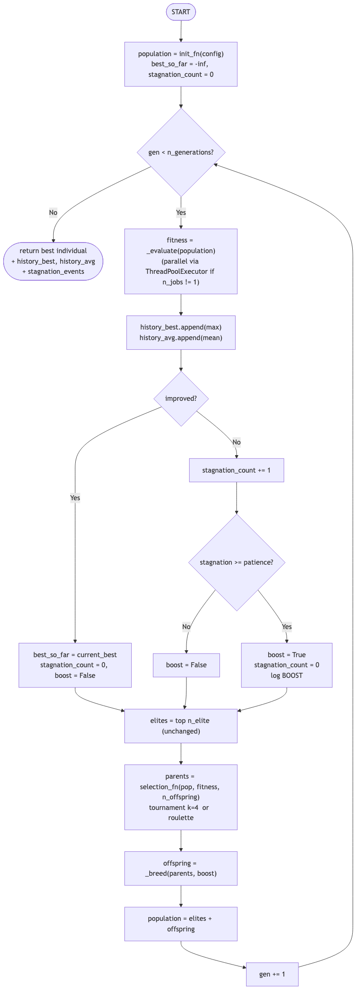
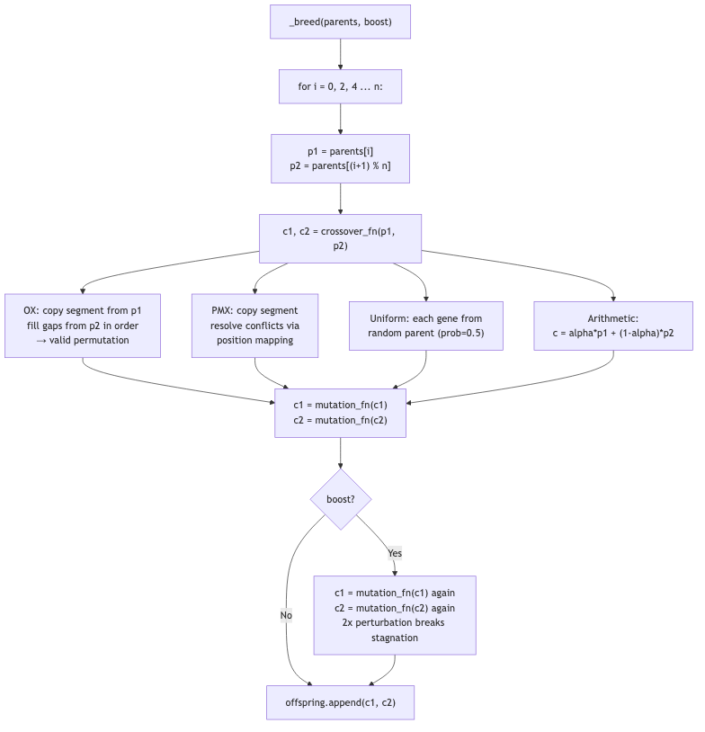
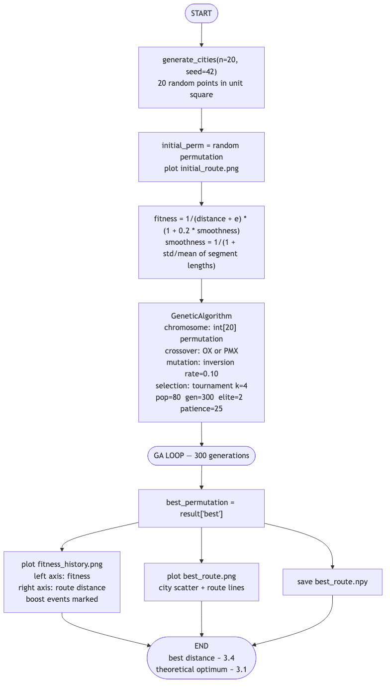
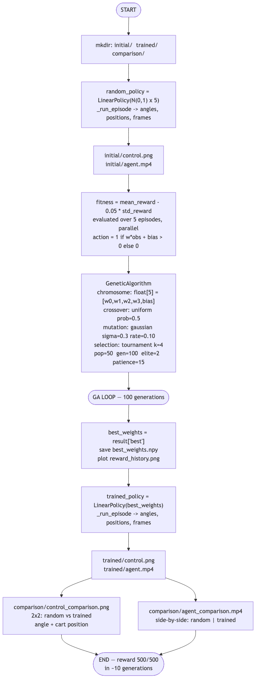
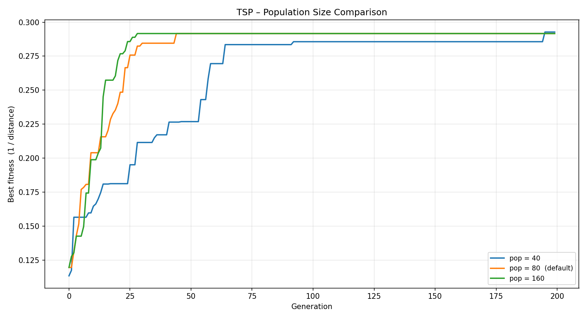
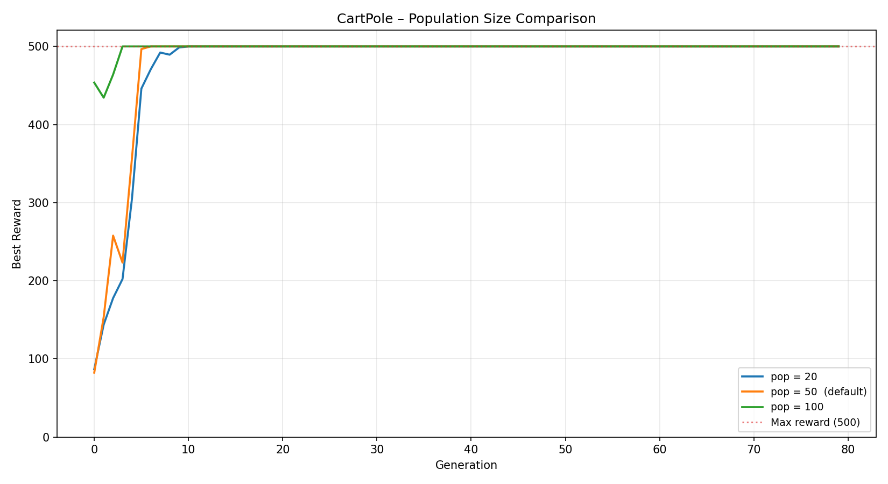
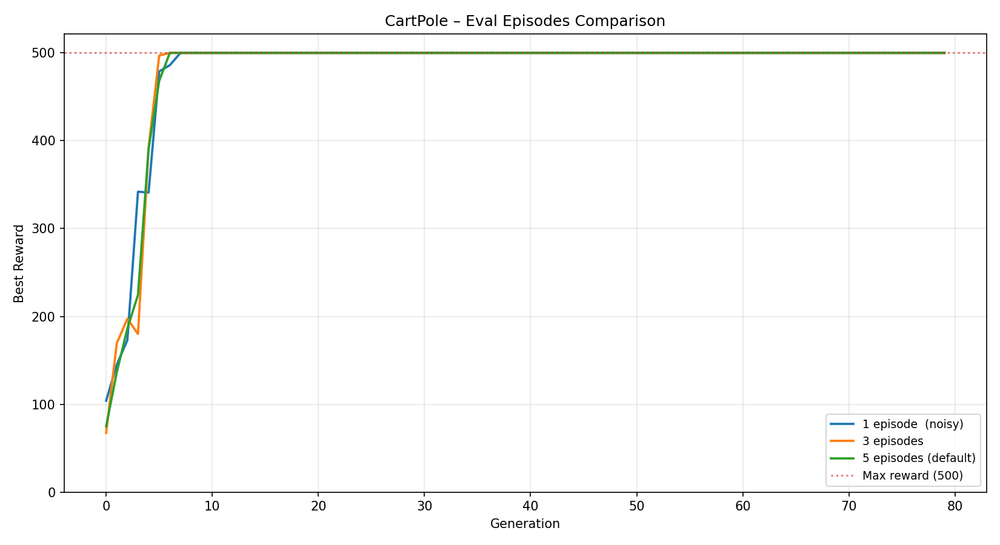

<!-- _class: lead -->

# Genetic Algorithm
## TSP & CartPole-v1

**BIAI — Progress Report**

Piotr Krupiński · Jeremi Szczotka

Politechnika Śląska · 2026

github.com/piotrek1459/biai-genetic-cartpole

---

## Selected Topics

<div class="columns">
<div>

### Task 1 — TSP
**Traveling Salesman Problem**

Find the shortest route visiting all cities exactly once and returning to the start.

- Classic combinatorial optimisation
- Chromosome: **permutation** of city indices
- Fitness: `1 / (distance + ε)`

</div>
<div>

### Task 2 — CartPole-v1
**Gymnasium reinforcement environment**

Keep a pole balanced on a moving cart by pushing left or right.

- Control / policy learning task
- Chromosome: **real-valued** weight vector
- Fitness: mean episode reward

</div>
</div>

> Both problems are fundamentally different — TSP requires permutation operators, CartPole requires real-valued operators. One codebase handles both.

---

## Project Goals

1. Implement a **generic GA framework** reusable across problem types
2. Implement all core **genetic operators** from scratch:
   - Selection: tournament, roulette
   - Crossover: OX, PMX (permutation) · uniform, arithmetic (real-valued)
   - Mutation: swap, inversion, scramble (permutation) · Gaussian (real-valued)
3. **Solve TSP** for 20 cities — minimise total route distance
4. **Solve CartPole** — learn a linear policy that achieves max reward (500)
5. **Compare hyperparameters** — operators, population size, mutation strength
6. Produce visualisations, comparison plots, and an agent video

---

## Plan of Work

| Phase | Task | Status |
|-------|------|--------|
| 1 | Repository scaffold, `requirements.txt`, virtualenv | ✅ Done |
| 2 | Common operators — `selection.py`, `mutation.py`, `crossover.py` | ✅ Done |
| 3 | Generic `GeneticAlgorithm` class (`ga_base.py`) | ✅ Done |
| 4 | Task 1: TSP — training, visualisation, experiments | ✅ Done |
| 5 | Task 2: CartPole — policy, training, agent video, experiments | ✅ Done |
| 6 | README, `.gitignore`, documentation, progress report | ✅ Done |

**All phases complete.** Both algorithms run end-to-end and produce results.

---

<!-- _style: "section { font-size: 0.88em; }" -->

## Implementation Overview

<div style="display:grid; grid-template-columns: 1fr 1fr; gap: 1.5em;">
<div>

```
src/
  common/
    ga_base.py      ← GeneticAlgorithm class
    selection.py    ← tournament, roulette
    crossover.py    ← OX, PMX, uniform, arithmetic
    mutation.py     ← swap, inversion, scramble,
                       gaussian
  task1_tsp/
    tsp_ga.py       ← CONFIG + run_tsp()
    experiments.py  ← operator & population runs
  task2_cartpole/
    cartpole_policy.py  ← LinearPolicy
    train_ga.py         ← CONFIG + run_cartpole()
    evaluate.py         ← record agent as MP4
    experiments.py      ← sigma, pop, episodes
```

</div>
<div>

**Design principle:**

The `GeneticAlgorithm` class is **fully generic** — it receives operators as callables and has no knowledge of TSP or CartPole.

```python
GeneticAlgorithm(
  config       = {...},
  init_fn      = init_population,
  fitness_fn   = make_fitness_fn(...),
  crossover_fn = ox_crossover,
  mutation_fn  = inversion_mutation,
  selection_fn = tournament_selection,
)
```

</div>
</div>

---

## Module Architecture

How `src/common/` operators are shared between both tasks.


---

## GA Loop — Core Algorithm (1/2)

The `GeneticAlgorithm.run()` loop — shared by both tasks.



---

## GA Loop — Core Algorithm (2/2): Breeding

How each pair of parents produces offspring inside `_breed()`.



---

## Task 1: TSP — Full Execution Flow



---

## Task 2: CartPole — Full Execution Flow



---

<!-- _style: "section { font-size: 0.82em; }" -->

## GA Core — Genetic Operators

<div class="columns">
<div>

### Selection
| Method | Key property |
|--------|-------------|
| Tournament (`k=4`) | Tunable pressure via `k` |
| Roulette wheel | Proportional to fitness |

### Crossover
| Operator | Type |
|----------|------|
| OX — Order Crossover | Permutation |
| PMX — Partially Mapped | Permutation |
| Uniform | Real-valued |
| Arithmetic blend | Real-valued |

</div>
<div>

### Mutation
| Operator | Type |
|----------|------|
| Swap | Permutation |
| Inversion *(default TSP)* | Permutation |
| Scramble | Permutation |
| Gaussian N(0, σ) | Real-valued |

### Elitism
Top `n_elite = 2` individuals are copied unchanged into the next generation, preventing loss of the best solution found so far.

</div>
</div>

---

## Task 1: TSP — Algorithm

**Chromosome:** permutation of city indices, e.g. `[2, 0, 4, 1, 3]`
→ route: city 2 → city 0 → city 4 → city 1 → city 3 → city 2

**Fitness:**
$$f(\text{route}) = \frac{1}{\text{total distance} + \varepsilon}$$

Maximising fitness ≡ minimising total Euclidean round-trip distance.

**Default configuration:**

| pop | generations | crossover | mutation | elites | tournament k |
|-----|-------------|-----------|----------|--------|--------------|
| 80  | 300         | OX        | Inversion, rate=0.10 | 2 | 4 |

Cities: 20 random points in [0, 1]² · Theoretical optimum ≈ 3.1

---

## Task 1: TSP — Results

<div class="columns">
<div>


Fitness converges quickly in the first ~50 generations and stabilises around the near-optimal solution.

</div>
<div>


**Best route distance: 3.43**
Theoretical optimum ≈ 3.1 — within ~10% of optimal.

</div>
</div>

---

## Task 1: TSP — Operator Comparison


All four operator combinations converge to a similar quality. **Inversion+OX** is the default choice — good balance of exploration and exploitation.

---

## Task 1: TSP — Population Size Comparison



All population sizes reach similar final fitness. Larger populations show more stable convergence curves but require more computation per generation.

---

<!-- _style: "section { font-size: 0.85em; }" -->

## Task 2: CartPole — Algorithm

**Environment:** 4D observation `[cart_pos, cart_vel, pole_angle, pole_angular_vel]`
**Action:** push left (0) or push right (1) · **Max reward: 500**

**Linear policy (chromosome = 5 real numbers):**

$$\text{action} = \begin{cases} 1 & \text{if } w_0 \cdot \text{pos} + w_1 \cdot \text{vel} + w_2 \cdot \theta + w_3 \cdot \dot\theta + b > 0 \\ 0 & \text{otherwise} \end{cases}$$

**Fitness:** mean total reward over 5 independent episodes.

**Default configuration:**

| pop | generations | crossover | mutation | elites | episodes/eval |
|-----|-------------|-----------|----------|--------|---------------|
| 50  | 100         | Uniform   | Gaussian σ=0.3, rate=0.10 | 2 | 5 |

---

## Task 2: CartPole — Results


**Maximum reward (500) reached at generation 10.** The linear policy is sufficient to fully solve CartPole-v1. Agent video saved to `results/task2/agent.mp4`.

---

## Task 2: CartPole — Sigma Comparison


All three sigma values eventually reach reward 500. Smaller σ converges more smoothly; larger σ shows higher variance but can escape local optima faster.

---

## Task 2: CartPole — Population & Episodes Comparison

<div class="columns">
<div>



Larger populations start with better initial diversity — `pop=100` hits reward 500 within the first few generations.

</div>
<div>



More evaluation episodes reduce fitness noise, leading to smoother and more reliable convergence.

</div>
</div>

---

<!-- _style: "section { font-size: 0.84em; }" -->

## Conclusions

### Task 1 — TSP ✅
- GA reduces route distance from ~6 (random) to **3.43** — within 10% of the theoretical optimum (~3.1)
- All operator combinations perform similarly; **OX + inversion** is the most consistent choice

### Task 2 — CartPole ✅
- GA discovers a working **linear policy** in just **10 generations**
- Best agent achieves **reward = 500/500** every episode (maximum possible)
- CartPole-v1 is linearly solvable — a 5-parameter chromosome is sufficient

---

<!-- _class: lead -->

## Key Takeaway

A single generic GA framework with **pluggable operators** handles both discrete (permutation) and continuous (real-valued) optimisation problems effectively.

---

<!-- _class: lead -->

# Thank You

**Repository:** github.com/piotrek1459/biai-genetic-cartpole

```bash
# Run TSP
python3 -m src.task1_tsp.tsp_ga

# Run CartPole
python3 -m src.task2_cartpole.train_ga
python3 -m src.task2_cartpole.evaluate
```

Piotr Krupiński · Jeremi Szczotka
