<!-- _class: lead -->

# Genetic Algorithm
## TSP & CartPole-v1

**BIAI — Final Report**

Piotr Krupiński · Jeremi Szczotka

Politechnika Śląska · 2026

[github.com/piotrek1459/biai-genetic-cartpole](https://github.com/piotrek1459/biai-genetic-cartpole)

---

## Problem Statement

### Task 1 — TSP
Find the **shortest round-trip route** visiting every city exactly once.

- NP-hard combinatorial optimisation
- No polynomial exact algorithm for large n
- Chromosome: **permutation** of city indices
- Fitness: `1 / (distance + ε)`
- 20 cities, theoretical optimum ≈ 3.1

### Task 2 — CartPole-v1
**Balance a pole** on a moving cart — push left or right each step.

- Continuous control task (Gymnasium)
- Episode ends when pole falls (> ±12°) or cart drifts (> ±2.4)
- Chromosome: **5 real-valued weights** `[w₀..w₃, bias]`
- Fitness: mean reward over 5 episodes
- Max reward: **500 steps**

> Why GA? Both problems have large, poorly-understood search spaces where gradient methods are inapplicable or ineffective.

---

<!-- _style: "section { font-size: 0.9em; }" -->

## Genetic Algorithm — Key Idea

Inspired by **biological evolution**: a population of candidate solutions improves over generations.

| Step | What happens |
|------|-------------|
| **1. Initialise** | Create a random population of `pop_size` individuals |
| **2. Evaluate** | Compute fitness for every individual (parallel if `n_jobs ≠ 1`) |
| **3. Elitism** | Copy the top `n_elite` individuals unchanged |
| **4. Selection** | Choose parents: **tournament** (draw k, pick best) or **roulette** (∝ fitness) |
| **5. Crossover** | Combine two parents → two children |
| **6. Mutation** | Randomly perturb each child |
| **7. Replace** | New population = elites + offspring; repeat |

**Adaptive boost:** if fitness does not improve for `patience` generations, mutation is applied **twice** per offspring — inspired by RL exploration vs. exploitation.

---

<!-- _style: "section { font-size: 0.82em; }" -->

## GA Operators — Quick Reference

### Selection
| Method | Key property |
|--------|-------------|
| Tournament (k=4) | Tunable pressure; higher k → faster convergence |
| Roulette wheel | Proportional to fitness; weaker pressure |

### Crossover
| Operator | Domain | Description |
|----------|--------|-------------|
| OX | Permutation | Copy segment from p1; fill from p2 in order |
| PMX | Permutation | Copy segment; resolve conflicts via mapping |
| Uniform | Real-valued | Each gene from random parent (p=0.5) |
| Arithmetic | Real-valued | `c = α·p1 + (1−α)·p2`, α~U(0,1) |

### Mutation
| Operator | Domain | Description |
|----------|--------|-------------|
| Inversion *(default TSP)* | Permutation | Reverse a random sub-sequence |
| Swap | Permutation | Swap two random genes |
| Scramble | Permutation | Shuffle a random sub-sequence |
| Gaussian N(0,σ) *(CartPole)* | Real-valued | Add noise to each gene independently |

### Elitism
Top `n_elite = 2` individuals are **copied unchanged** into the next generation — prevents losing the best solution found.

---

## Architecture — One GA, Two Problems

`src/common/` contains the shared generic core. Both tasks inject their domain logic as callables.

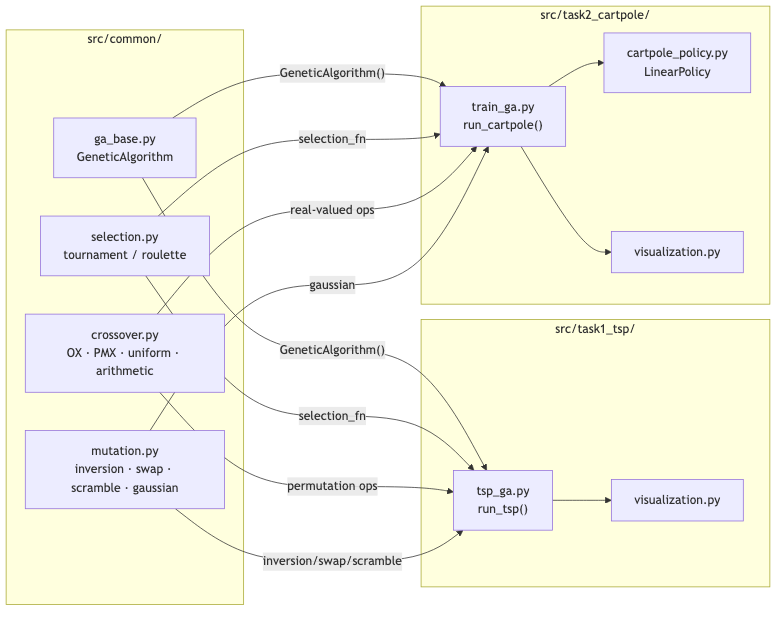

---

## The Plugin Interface — The "Switch"

The **only difference** between TSP and CartPole is which 5 functions are passed to `GeneticAlgorithm()`. The core loop in `ga_base.py` never changes.

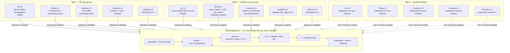

---

<!-- _style: "section { font-size: 0.78em; }" -->

## Pseudocode — GA Algorithm

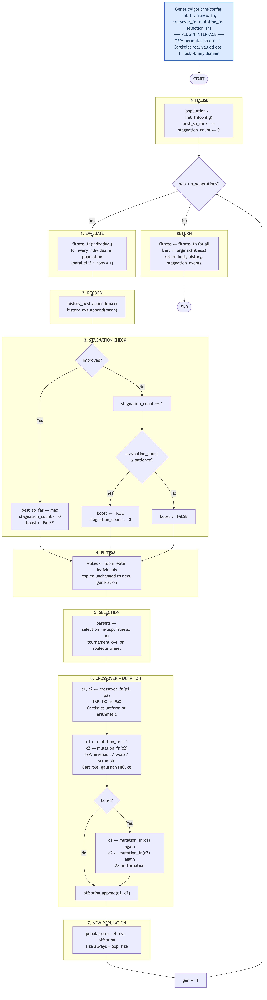

---

<!-- _style: "section { font-size: 0.88em; }" -->

## Task 1: TSP — Representation & Fitness

**Chromosome:** integer permutation — e.g. `[2, 0, 4, 1, 3]` = route city2→city0→city4→city1→city3→city2

**Combined fitness function:**
$$f = \frac{1}{d + \varepsilon} \times \left(1 + w_s \cdot \frac{1}{1 + CV}\right)$$

where $d$ = total Euclidean round-trip distance, $CV$ = coefficient of variation of segment lengths (rewards balanced routes), $w_s = 0.2$.

**Default config:** pop=80, gen=300, crossover=OX, mutation=inversion (rate=0.10), tournament k=4, elites=2, patience=25

---

## Task 1: TSP — Before vs After

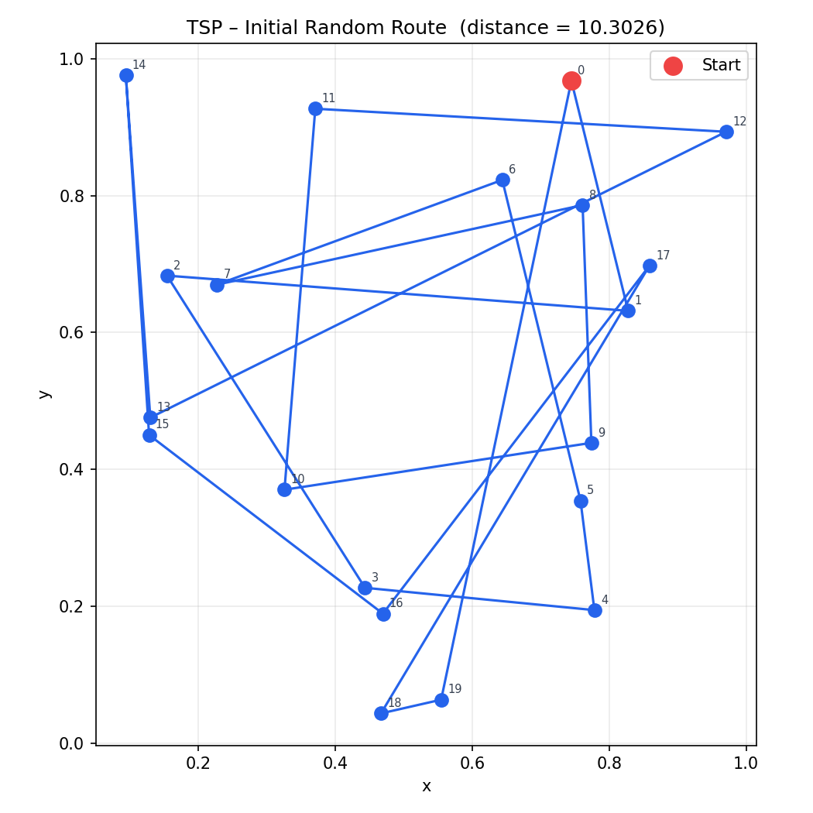
**Initial:** random permutation, distance ≈ 6–8

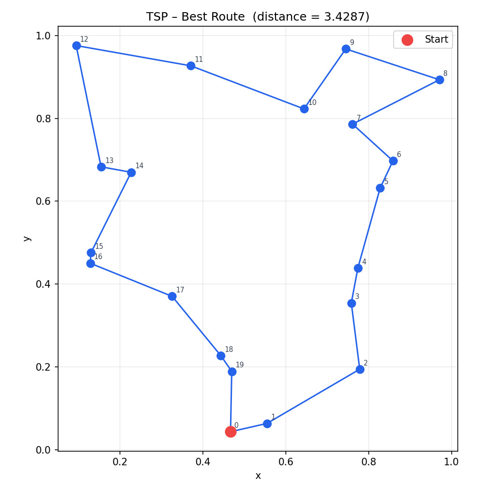
**After GA:** distance = **3.43** (optimum ≈ 3.1, within 10%)

---

## Task 1: TSP — Convergence & Operator Comparison

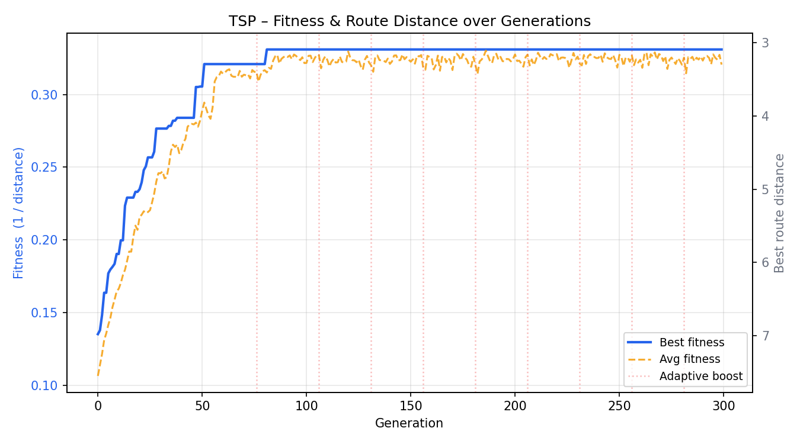
Dual axis: fitness (left) + distance (right). Fitness stabilises after ~50 generations.

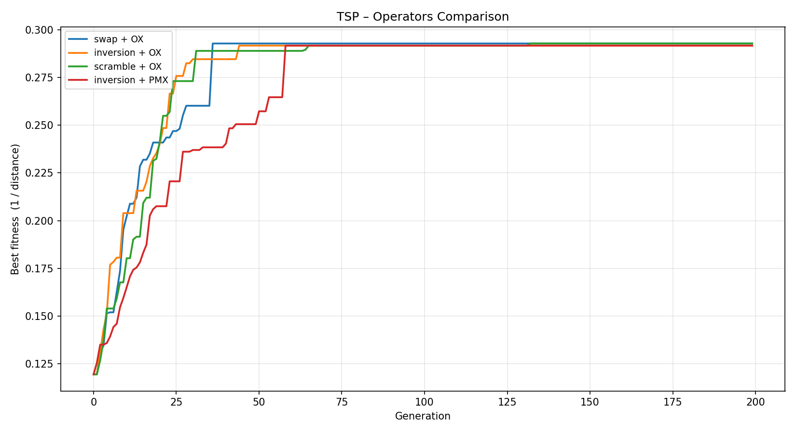
All operator combinations reach similar quality. **Inversion+OX** converges most reliably.

---

<!-- _style: "section { font-size: 0.88em; }" -->

## Task 2: CartPole — Representation & Policy

**Chromosome:** `[w₀, w₁, w₂, w₃, bias]` — 5 real numbers

**Linear policy:**
$$\text{action} = \begin{cases} 1 & \text{if } w_0 \cdot \text{pos} + w_1 \cdot \text{vel} + w_2 \cdot \theta + w_3 \cdot \dot\theta + b > 0 \\ 0 & \text{otherwise} \end{cases}$$

**Stability-penalised fitness:**
$$f = \bar{r} - 0.05 \cdot \sigma_r$$

Penalising reward variance selects policies that are consistently good — not just occasionally lucky.

**Default config:** pop=50, gen=100, crossover=uniform, mutation=gaussian σ=0.3, 5 episodes/eval, patience=15

---

## Task 2: CartPole — Before vs After

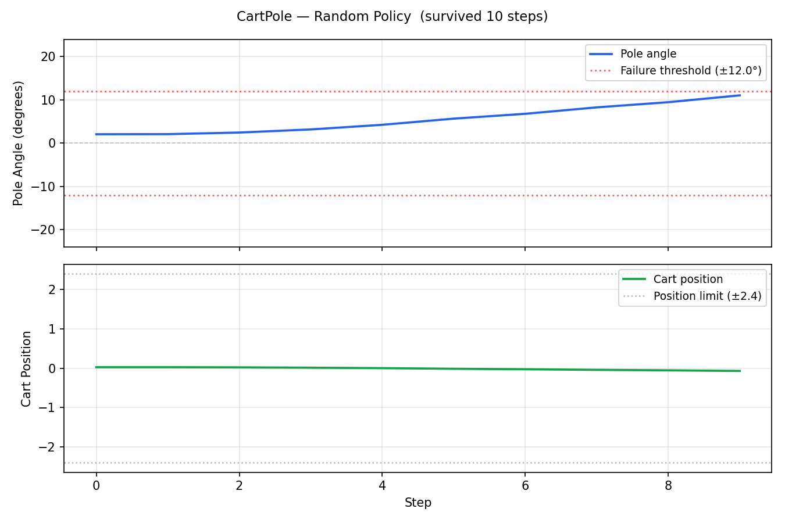
**Random policy:** pole falls in ~10 steps

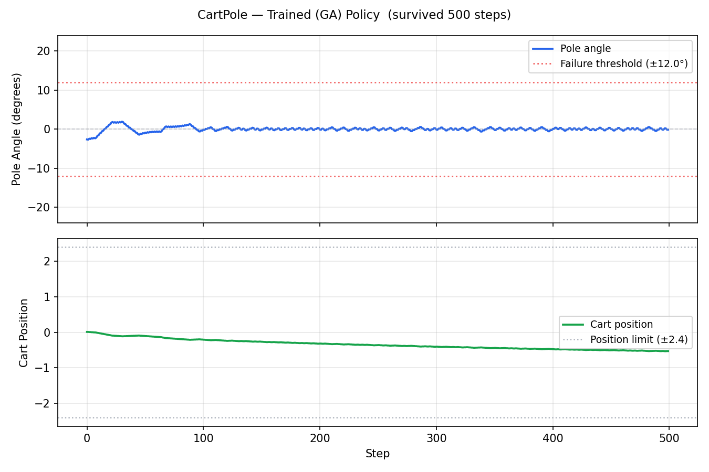
**Trained policy:** survives all **500 steps**, angle near 0°

---

## Task 2: CartPole — Convergence & Sigma Comparison

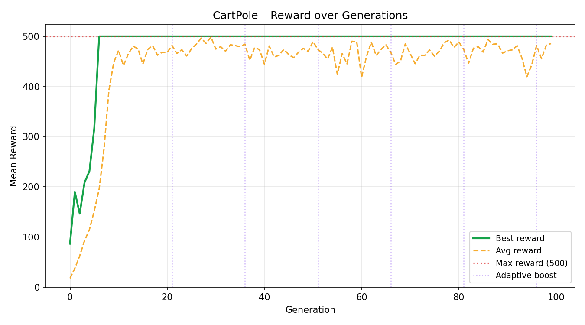
Reward = **500** (maximum) reached at **generation 10**.

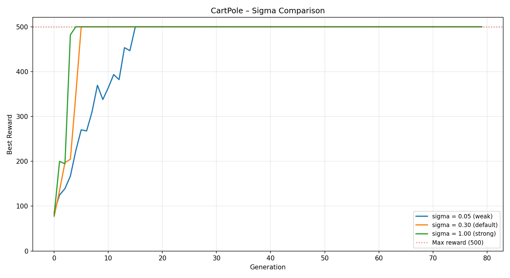
All σ values converge. Smaller σ is smoother; larger σ has higher initial variance.

---

## Conclusions

### Task 1 — TSP ✅
- GA reduces route distance from **~6–8** (random) to **3.43** — within **10%** of theoretical optimum
- OX + inversion is the most consistent operator combination
- Smoothness bonus in fitness discourages zigzagging routes

### Task 2 — CartPole ✅
- GA finds a working **linear policy** in just **10 generations**
- Best agent achieves **reward = 500/500** every episode
- Stability penalty in fitness selects for robust, consistent policies

### Architecture
- **One generic GA, any domain** — add a new problem by implementing 5 functions only
- Adaptive mutation (boost) and parallel evaluation added after reviewer feedback

---

<!-- _class: lead -->

# Thank You

**Repository:** [github.com/piotrek1459/biai-genetic-cartpole](https://github.com/piotrek1459/biai-genetic-cartpole)

Piotr Krupiński · Jeremi Szczotka
